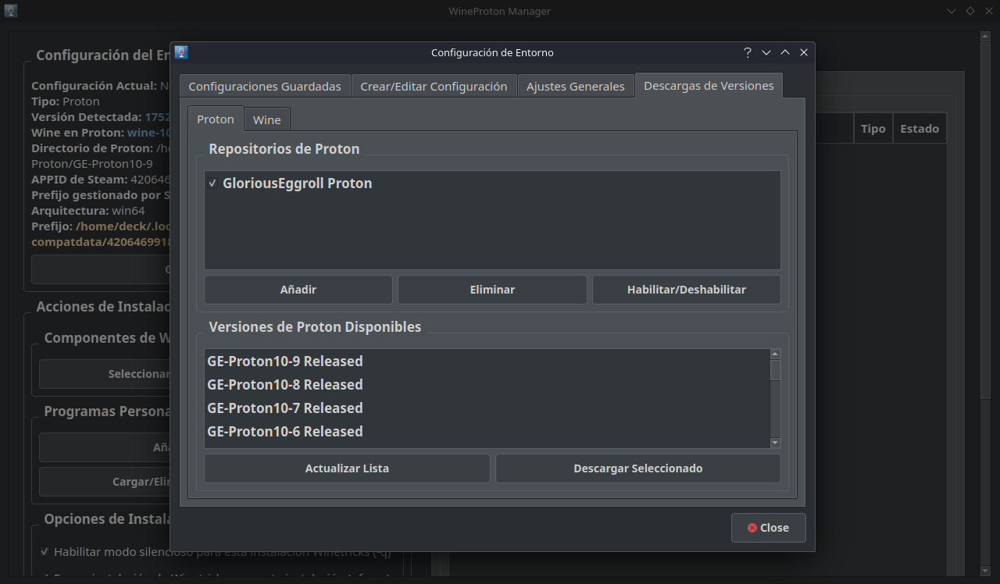

# 🍷 WineProton Manager

[](https://www.python.org/)
[](https://www.riverbankcomputing.com/software/pyqt/)
[](https://www.gnu.org/licenses/gpl-3.0)
[](https://www.steamdeck.com/)

---


|   **English**  |   **Español**  |
|----------------|----------------|
| **WineProton Manager** is an advanced Python tool that revolutionizes how you manage Wine and Proton prefixes on Linux systems, including Steam Deck. It provides:<br><br>• **One-click environment management** for games and Windows applications<br>• **Deep Proton integration** with Steam compatibility<br>• **Automated dependency handling** via Winetricks<br>• **Cross-distribution support** with optimized performance<br><br>Perfect for gamers, developers, and Linux enthusiasts who need precise control over their compatibility layers. | **WineProton Manager** es una herramienta avanzada en Python que revoluciona la gestión de prefixes de Wine y Proton en Linux, incluyendo Steam Deck. Ofrece:<br><br>• **Gestión de entornos con un clic** para juegos y aplicaciones Windows<br>• **Integración profunda con Proton** y compatibilidad con Steam<br>• **Manejo automático de dependencias** mediante Winetricks<br>• **Soporte multi-distribución** con rendimiento optimizado<br><br>Ideal para gamers, desarrolladores y entusiastas de Linux que necesitan control preciso sobre sus capas de compatibilidad. |

---

## ✨ Key Features / Características Principales

### 🛠️ Core Functionality
- **Prefix Lifecycle Management**  
  Create, clone, repair, and delete prefixes with visual feedback
- **Version Switcher**  
  Seamlessly switch between Wine/Proton versions per application
- **Winetricks Integration**  
  Automated installation of common components (DirectX, .NET, etc.)

### 🎮 Gaming Optimizations
- **Steam Deck Verified**  
  Touchscreen-optimized UI with controller support
- **Game-Specific Profiles**  
  Save optimal configurations for each title
- **Performance Tweaks**  
  Pre-configured optimizations for gaming

### 🖥️ Desktop Enhancements
- **EXE/MSI Launcher**  
  Run Windows installers directly from the UI
- **Sandbox Environments**  
  Isolate risky applications in disposable prefixes
- **System Monitoring**  
  Real-time resource usage tracking

---

## 📸 Visual Tour / Galería Visual

<div align="center">
  
  
  <br>
  
  
</div>

---

## Run the Application

1. Install Prerequisites:
   ```bash
   # 🔧 Install system dependencies

   # Debian/Ubuntu
   sudo apt update
   sudo apt install python3-venv git wine winetricks konsole kdialog libssl3
   # Arch Linux
   sudo pacman -S python3-venv git wine winetricks konsole kdialog libssl3
   # Fedora
   sudo dnf install python3-venv git wine winetricks konsole kdialog libssl3


2. Clone the Repository:
   ```bash
   # 📦 Clone repository
   sudo apt install wine winetricks konsole kdialog libssl3
   git clone https://github.com/EstebanKZL/WineProtonManager.git
   cd WineProtonManager

3. Set Up a Virtual Environment and Install Dependencies:
   ```bash
   # 🐍 Install packages from requirements.txt
   python3 -m venv .venv
   source .venv/bin/activate
   pip install --upgrade pip
   pip install -r requirements.txt

3. Run the Application:
   ```bash
   # 🏃 Run
   python3 main.py
