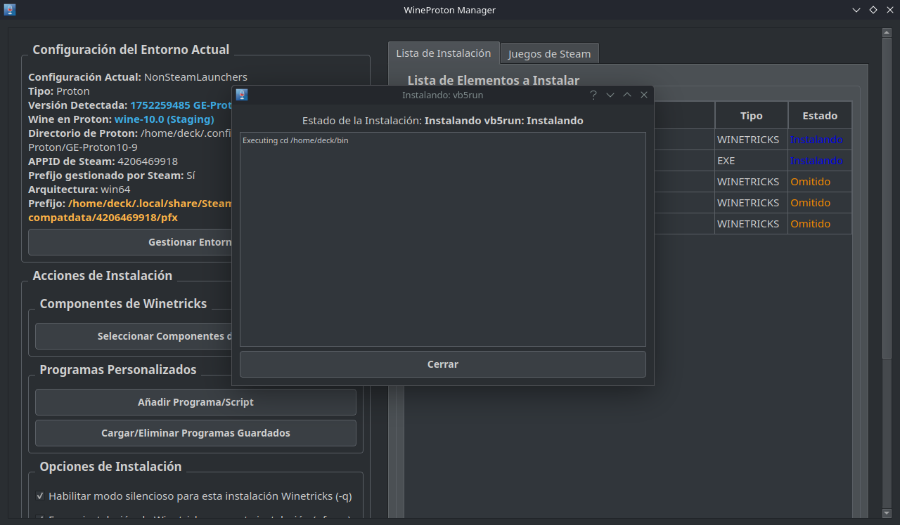
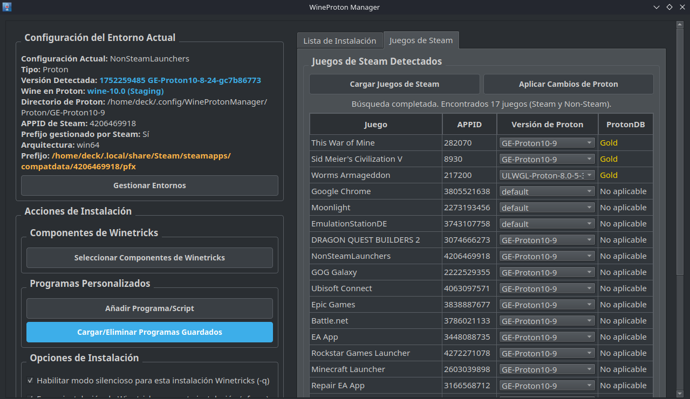

# 🍷 WineProton Manager  


## **WineProtonManager es una herramienta en Python que te permite gestionar, organizar y cambiar fácilmente las versiones de Proton y Wine para tus juegos en Steam y aplicaciones en Linux (incluyendo Steam Deck)**  

🔧 **Características principales**:  
- Gestión de múltiples prefixes (Wine y Proton)  
- Instalación automatizada de componentes via Winetricks  
- Soporte para programas personalizados (.exe/.msi)
- Visualización detallada de entornos  
- Interfaz intuitiva con temas claro/oscuro
- Plataforma (Linux)  

---
## Requisitos
- Python 3.8+
- PyQt5
- Wine/Proton instalado
- Winetricks

🖼️ **Captura**:  


---
🚀 Instalación  

    ```bash
    # Requisitos previos
    sudo apt install wine winetricks konsole kdialog libssl3  # Para Linux
    
    # Clonar repositorio
    git clone https://github.com/EstebanKZL/WineProtonManager.git
    cd WineProtonManager
    
    # Instalar dependencias
    pip install -r requirements.txt
    
    # Ejecutar
    python3 main.py
    
    Consulta el archivo [INSTALL.md](docs/INSTALL.md) para instrucciones detalladas.

## Licencia
Este proyecto está licenciado bajo [GPL-3.0](LICENSE).

---

### ✅ 6️⃣ Palabras clave al final

```markdown
## Palabras clave

Proton, Wine, Linux gaming, Steam Deck, Steam Linux, proton manager, wine manager, compatdata, configuración proton, herramientas Linux juegos
