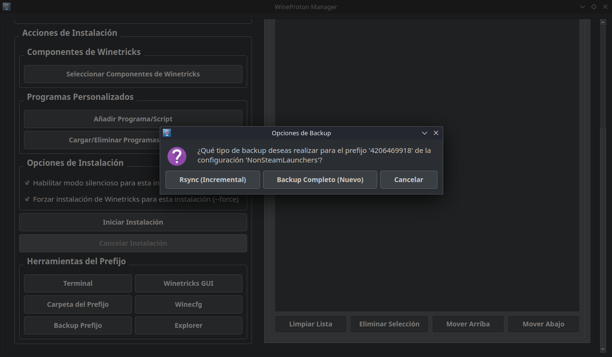

# 🍷 WineProton Manager

[](https://www.python.org/)
[](https://www.riverbankcomputing.com/software/pyqt/)
[](https://www.gnu.org/licenses/gpl-3.0)
[](https://www.steamdeck.com/)

---


|   **English**  |   **Español**  |
|----------------|----------------|
| **WineProton Manager** is an advanced Python tool that revolutionizes how you manage Wine and Proton prefixes on Linux systems, including Steam Deck. It provides:<br><br>• **One-click environment management** for games and Windows applications<br>• **Deep Proton integration** with Steam compatibility<br>• **Automated dependency handling** via Winetricks<br>• **Cross-distribution support** with optimized performance<br><br>Perfect for gamers, developers, and Linux enthusiasts who need precise control over their compatibility layers. | **WineProton Manager** es una herramienta avanzada en Python que revoluciona la gestión de prefixes de Wine y Proton en Linux, incluyendo Steam Deck. Ofrece:<br><br>• **Gestión de entornos con un clic** para juegos y aplicaciones Windows<br>• **Integración profunda con Proton** y compatibilidad con Steam<br>• **Manejo automático de dependencias** mediante Winetricks<br>• **Soporte multi-distribución** con rendimiento optimizado<br><br>Ideal para gamers, desarrolladores y entusiastas de Linux que necesitan control preciso sobre sus capas de compatibilidad. |

---

## ✨ Key Features

### 🛠️ Environment & Prefix Management
- **Multiple Environment Profiles** Create and manage separate configurations for different games or applications, each with its own Wine/Proton version, architecture, and prefix path.
- **Prefix Initialization & Tools** Create new Wine prefixes with visual feedback. Instantly access essential tools for any prefix, including `winecfg`, `explorer`, `winetricks-gui`, and a pre-configured terminal.
- **Sandbox-Style Isolation** Easily manage multiple, isolated Wine prefixes to prevent application conflicts and ensure clean, stable environments for your software.

### 📦 Installation & Component Management
- **Unified Installer** Install components from multiple sources in a single queue: Winetricks verbs (like `d3dcompiler_47`), Windows installers (`.exe`/`.msi`), and custom Winetricks scripts (`.wtr`).
- **Batch Installation Queue** Add multiple items to an installation queue and manage it by reordering, deleting, or temporarily skipping items. The process continues automatically even if one item fails.
- **Winetricks Component Browser** Easily browse and select common Winetricks components from organized categories like 'DirectX', '.NET Framework', and 'Visual C++ Runtimes'.
- **Non-Blocking UI** The user interface remains fully responsive during downloads and installations, allowing you to monitor progress without the app freezing.

### 🎮 Steam Integration
- **Full Steam Library View** Automatically detects and displays all your installed Steam games and Non-Steam shortcuts in a dedicated tab.
- **Per-Game Proton Version Control** Assign specific official or custom (Proton-GE) Proton versions to any game directly from the manager, with changes saved safely to your Steam configuration.
- **ProtonDB Integration** View at-a-glance ProtonDB compatibility ratings (Platinum, Gold, Silver, etc.) for your games to anticipate performance and potential issues.

### 📂 Version & Backup Management
- **Wine/Proton Downloader** Browse, download, and manage different Wine and Proton versions directly from community GitHub repositories (like GloriousEggroll and Kron4ek) via a built-in repository manager.
- **Advanced Backup System** Perform robust backups of your prefixes. Choose between a **Full Backup** (a new timestamped copy) or an **Incremental Backup** (using `rsync` to efficiently update an existing full backup).
- **Pre-Action Safety Prompts** Get automatically prompted to create a backup before running potentially destructive actions, ensuring your important prefixes are always safe.

---

## 📸 Visual Tour / Galería Visual

<div align="center">
  
  
  <br>
  
  
</div>

---

## Run the Application

1. Install Prerequisites:
   ```bash
   # 🔧 Install system dependencies

   # Debian/Ubuntu
   sudo apt update
   sudo apt install python3-venv git wine winetricks konsole kdialog libssl3
   # Arch Linux
   sudo pacman -S python3-venv git wine winetricks konsole kdialog libssl3
   # Fedora
   sudo dnf install python3-venv git wine winetricks konsole kdialog libssl3


2. Clone the Repository:
   ```bash
   # 📦 Clone repository
   sudo apt install wine winetricks konsole kdialog libssl3
   git clone https://github.com/EstebanKZL/WineProtonManager.git
   cd WineProtonManager

3. Set Up a Virtual Environment and Install Dependencies:
   ```bash
   # 🐍 Install packages from requirements.txt
   python3 -m venv .venv
   source .venv/bin/activate
   pip install --upgrade pip
   pip install -r requirements.txt

3. Run the Application:
   ```bash
   # 🏃 Run
   python3 main.py
